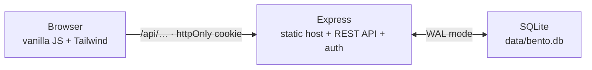

# Bento OS 🍱

A personal knowledge base, prompt library and code-snippet vault in one
macOS-style window. Vanilla JS + Tailwind, no framework, installable as an app
and reachable from anywhere over Tailscale.

<!-- variant:local -->
> [!NOTE]
> **Backend: local SQLite + Express.** Everything runs on your machine — no
> cloud account, no network dependency, and the database is a file you can
> copy. The **Supabase (PostgreSQL + Auth)** build is the default and lives on
> [`main`](../../tree/main): same frontend, same RBAC model, same GDPR
> guarantees, reachable from anywhere.
<!-- /variant -->


<!-- Screenshots live in docs/images/ and are shared by both branches — the UI
     is identical on each. -->
<table>
<tr>
<td width="50%"></td>
<td width="50%"></td>
</tr>
</table>

---

## What's inside

Three tools in one window. Every record belongs to exactly one account.

### 📓 Docs LogBook

Long-form markdown notes — guides, write-ups, and the fix you'll want again in
eight months.

- **Reading and Editor modes.** Notes open as clean rendered prose at a
  comfortable measure; one toggle switches to the split editor.
- **Rich rendering:** markdown-it → KaTeX (math) → Mermaid (diagrams) → Prism
  (28 languages) → DOMPurify. Click any code block to copy it.
- **Your own metadata fields**, labels, sub-labels, tags, a summary block,
  collapsible URL lists and an editable Modified time.
- **One search** across titles, tags, custom fields, summary and body, plus
  group-by and tag-filter pills.
- **Autosaves every 10 seconds** while you type, with a restore prompt after a
  crash, and a conflict guard so a second tab can't silently overwrite you.

### 💬 Prompt Library

The prompts you keep rewriting, saved once and grouped by category.

- Cards with a monospace body, search and tag-filter pills.
- **`{{Variable}}` blanks** you fill in on the card itself — the copy buffer
  updates as you type, and one click copies the finished text.
- **"Why this works"** takes markdown, rendered through the same sanitised
  pipeline as the LogBook.

### 🧩 Code Snippets

Commands and code you'd rather not look up twice.

- Language and tool categories get a deterministic colour accent — no palette
  to configure.
- Syntax highlighting, the same `{{Variable}}` engine, and **markdown Notes**
  on the back of each card.

### The window itself

Real traffic lights: 🔴 minimises the tool to a dock pill with its state
intact, 🟡 toggles Focus Mode (`⌘.` / `Ctrl+.`), 🟢 goes fullscreen. `⌘S`
saves. Signing in happens on a lock screen with a face card that reacts to
whether you got the password right. Dark-first, with a light variant and a
toggle that follows your device until you choose otherwise; everything honours
`prefers-reduced-motion`.

---

<!-- variant:local -->
## How it fits together



One process serves the app shell, the REST API and authentication. The session
rides in an httpOnly cookie, so no token is ever handled in JavaScript, and
nothing leaves the machine.

## Quick start

**Prerequisites:** Node 20. That's the whole list.

```bash
npm install
npm run dev        # build, then serve on http://127.0.0.1:3000
```

On first boot the database is created at `data/bento.db` and a **global admin**
is seeded — username `admin`, password `bentoos` — and you're forced to set a
new password before the workspace opens.

`npm start` skips the build and just starts the server.

> [!IMPORTANT]
> There is no client-side secret to protect here: password hashes and sessions
> never leave the server. The server binds to loopback only, deliberately
> ([SECURITY.md](docs/SECURITY.md) §4) — use the Tailscale serve below to reach
> it from another device rather than binding to `0.0.0.0`.

### Server environment

| Variable | Default | Purpose |
|---|---|---|
| `BENTO_PORT` | `3000` | Listening port |
| `BENTO_HOST` | `127.0.0.1` | Bind address — loopback only, deliberately ([SECURITY.md](docs/SECURITY.md) §4) |
| `BENTO_DB` | `data/bento.db` | Database file location |

## Running with Docker

The container is **stateful** — the database lives in `./data` on the host and
is bind-mounted in, the only writable path the image has:

```bash
docker compose up -d      # → http://127.0.0.1:8481
```

The production image is non-root, read-only apart from that mount,
`cap_drop: ALL`, with a healthcheck and a WAL-aware shutdown so the database is
never left mid-checkpoint. If Docker created `./data` as root, hand it over
with `sudo chown -R 1001:1001 ./data` or the server exits at boot. Full details
in [DOCKER.md](DOCKER.md).
<!-- /variant -->

---

## Install it as an app (PWA)

Bento OS ships a manifest and a service worker, so it installs to the dock or
home screen and launches in its own window: **Install Bento OS…** in the
account menu, your browser's own install control, or *Share → Add to Home
Screen* on iOS.

The service worker precaches the app shell — HTML, CSS, JS and the vendored
render libraries — so an installed Bento OS **opens offline** instead of
showing a browser error. It caches the *application* only: your content still
needs connectivity, so offline you get the workspace with an *offline* chip and
empty lists. That split is deliberate ([SECURITY.md](docs/SECURITY.md) §4a).

Registration needs a secure context — `localhost`, or the HTTPS Tailscale serve
below. Over plain-HTTP LAN the app runs online-only. Regenerate icons with
`npm run icons` after changing the mark.

## Remote access (Tailscale)

```bash
tailscale serve --bg https / http://127.0.0.1:3000
```

Then open `https://<machine>.<tailnet>.ts.net` from any tailnet device. HTTPS
matters: the copy buttons use the async Clipboard API, which only exists in
secure contexts (there's a manual-copy fallback otherwise).

---

<!-- variant:local -->
## Accounts, roles & data

- **Sign-in is User ID + password**, verified server-side against a scrypt
  hash; the session is an httpOnly cookie.
- **Three roles:** `global_admin` (exactly one), `admin` and `user`. Admins
  create users, reset passwords and delete accounts through `/api/users`;
  role changes are server-enforced, so no client request can elevate itself.
- **Admins cannot read your content.** Every content query is scoped to the
  session's user id — the blindness is structural, not a UI choice. The admin
  panel shows usernames, roles and join dates only.
- **Account deletion is a hard delete** (GDPR/PDPA): the account and everything
  it owns are permanently erased.
- **Backups are a file copy.** Stop the server (or use SQLite's backup API) and
  copy `data/bento.db` along with its `-wal` and `-shm` siblings.

See [docs/DATABASE-LOCAL.md](docs/DATABASE-LOCAL.md) for the schema, the FTS5
tables and the triggers.

## Repository layout

```
server/          Express: static host, REST API, auth, SQLite access
  migrations/      Schema, applied at boot
src/             Frontend source
  index.html       The whole window: lock screen, tabs, dialogs, ribbon
  css/input.css    Tailwind entry + design tokens
  js/              ES modules — see below
  sw.js            Service worker (app-shell precache)
scripts/         Build helpers
data/            bento.db and its WAL siblings (generated; gitignored)
dist/            Build output (generated; served by Express)
docs/            Implementation plan, security, database, UX, edge cases
```

## Build

| Script | What it does |
|---|---|
| `npm run dev` | Full build, then start the server |
| `npm run build` | CSS → static → vendor → JS → service worker |
| `npm run build:readable` | Same, unobfuscated, with an inline source map |
| `npm run icons` | Regenerate the PWA icon set |

`npm run build` bundles everything under `src/js/` into a single obfuscated
`dist/js/app.js` — the readable modules are never copied into `dist/`, so the
deployed app doesn't double as its own source listing. **Never deploy
`build:readable`**: its source map contains the full source. Obfuscation raises
the cost of reading the client; it is *not* a security control — keep secrets
server-side, which on this branch is where they already are.
<!-- /variant -->

The render libraries (markdown-it, KaTeX, Mermaid, DOMPurify, Prism) are
vendored into `dist/vendor/` at build time — the CSP forbids CDNs by design.
Prism is assembled from its core plus the grammars listed in
[scripts/copy-vendor.js](scripts/copy-vendor.js); add a language by adding its
name there.

Key modules in `src/js/`: [api.js](src/js/api.js) (every backend call,
normalised), [logbook.js](src/js/logbook.js), [prompts.js](src/js/prompts.js),
[snippets.js](src/js/snippets.js), [render.js](src/js/render.js) (the single
XSS-safe render choke point), [vars.js](src/js/vars.js) (the `{{Variable}}`
engine), [auth.js](src/js/auth.js) (lock screen, RBAC, admin panel),
[theme.js](src/js/theme.js), [tour.js](src/js/tour.js), [bus.js](src/js/bus.js).

---

## Two backends, one frontend

| | Branch | Backend |
|---|---|---|
| **Default / production** | `main` | Supabase (PostgreSQL + Auth), reached from the browser |
| **Offline dev / testing** | `dev-local-auth` | Local SQLite (WAL) + Express REST API |

Both share the same frontend, RBAC model and GDPR guarantees. The two designs
are documented side by side in
[IMPLEMENTATION-SUPABASE.md](docs/IMPLEMENTATION-SUPABASE.md) /
[DATABASE-SUPABASE.md](docs/DATABASE-SUPABASE.md) and
[IMPLEMENTATION-LOCAL.md](docs/IMPLEMENTATION-LOCAL.md) /
[DATABASE-LOCAL.md](docs/DATABASE-LOCAL.md).

<!-- variant:local -->
## Documentation map

| Document | Read it for |
|---|---|
| [PROJECT-BRIEF.md](PROJECT-BRIEF.md) | The original vision and feature spec |
| [docs/IMPLEMENTATION-PLAN.md](docs/IMPLEMENTATION-PLAN.md) | Architecture overview, runtime design, build history |
| [docs/IMPLEMENTATION-LOCAL.md](docs/IMPLEMENTATION-LOCAL.md) | This backend: REST contract, auth, RBAC middleware |
| [docs/UX-SPEC.md](docs/UX-SPEC.md) | Design tokens, layouts, accessibility acceptance criteria |
| [docs/DATABASE-LOCAL.md](docs/DATABASE-LOCAL.md) | Schema, FTS5, triggers, WAL pragmas |
| [docs/SECURITY.md](docs/SECURITY.md) | Threat model, render pipeline, hardening, audit checklist |
| [docs/EDGE-CASES.md](docs/EDGE-CASES.md) | Behaviour under conflicts, offline, reduced motion, empty states |
| [DOCKER.md](DOCKER.md) | Container images, compose, the volume and backups |
<!-- /variant -->

## Testing

API and UI test suites live in the session scratchpad during development; the
security audit checklist is in [docs/SECURITY.md](docs/SECURITY.md) §6.

## License

[MIT](LICENSE) — use it, fork it, ship it.

The libraries vendored into `dist/vendor/` keep their own licences (all MIT,
except DOMPurify which is MPL-2.0 or Apache-2.0). The build stacks their notices
into `dist/vendor/LICENSES.txt`, so any copy of `dist/` carries the attribution
those licences require.
