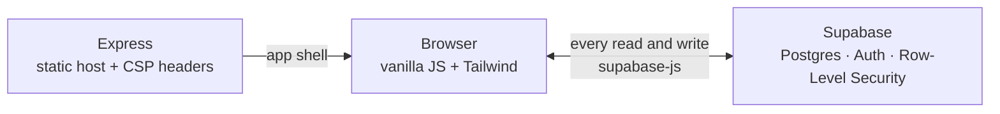

# Bento OS 🍱

[](LICENSE)
[](Dockerfile)
[](#-display-language)
[](https://github.com/aimanamri/bento-os/stargazers)
[](https://github.com/aimanamri/bento-os/commits)
[](https://github.com/aimanamri/bento-os)

A personal knowledge base, prompt library and code-snippet vault in one
macOS-style window. Vanilla JS + Tailwind, no framework, installable as an app,
available in **English, 日本語 and Bahasa Melayu**, and reachable from anywhere
over Tailscale — or run entirely offline against your own PostgreSQL in
Docker.

<!-- variant:supabase -->
> [!NOTE]
> **Backend: Supabase (PostgreSQL + Auth).** This is the default and the
> production target — the browser talks to Supabase directly, and the Node
> server here only serves static files. A functionally identical build backed
> by **local SQLite + Express** lives on the
> [`dev-local-auth`](../../tree/dev-local-auth) branch: same frontend, same
> RBAC model, same GDPR guarantees, no cloud account required.
<!-- /variant -->


<!-- Screenshots live in docs/images/ and are shared by both branches — the UI
     is identical on each. -->
<table>
<tr>
<td width="50%"></td>
<td width="50%"></td>
</tr>
</table>

---

## What's inside

Three tools in one window. Every record belongs to exactly one account.

### 📓 Docs LogBook

Long-form markdown notes — guides, write-ups, and the fix you'll want again in
eight months.

- **Reading and Editor modes.** Notes open as clean rendered prose at a
  comfortable measure; one toggle switches to the split editor.
- **Rich rendering:** markdown-it → KaTeX (math) → Mermaid (diagrams) → Prism
  (28 languages) → DOMPurify. Click any code block to copy it.
- **Your own metadata fields**, labels, sub-labels, tags, a summary block,
  collapsible URL lists and an editable Modified time.
- **One search** across titles, tags, custom fields, summary and body, plus
  group-by and tag-filter pills.
- **Autosaves every 10 seconds** while you type, with a restore prompt after a
  crash, and a conflict guard so a second tab can't silently overwrite you.

### 💬 Prompt Library

The prompts you keep rewriting, saved once and grouped by category.

- Cards with a monospace body, search and tag-filter pills.
- **`{{Variable}}` blanks** you fill in on the card itself — the copy buffer
  updates as you type, and one click copies the finished text.
- **"Why this works"** takes markdown, rendered through the same sanitised
  pipeline as the LogBook.

### 🧩 Code Snippets

Commands and code you'd rather not look up twice.

- Language and tool categories get a deterministic colour accent — no palette
  to configure.
- Syntax highlighting, the same `{{Variable}}` engine, and **markdown Notes**
  on the back of each card.

### The window itself

Real traffic lights: 🔴 minimises the tool to a dock pill with its state
intact, 🟡 toggles Focus Mode (`⌘.` / `Ctrl+.`), 🟢 goes fullscreen. `⌘S`
saves. Signing in happens on a lock screen with a face card that reacts to
whether you got the password right. Dark-first, with a light variant and a
toggle that follows your device until you choose otherwise; everything honours
`prefers-reduced-motion`.

### 🌐 Display language

**English, 日本語 and Bahasa Melayu**, switchable live from a globe icon in the
title bar (and on the lock screen, before you've signed in) — no reload, no
lost draft. The choice is remembered per device. Japanese gets its own type
stack (Hiragino / Yu Gothic / Noto Sans JP), proper line-breaking rules, and
natural です・ます / 体言止め phrasing rather than a literal translation; Malay
is written the way a Malaysian product actually talks to its users, keeping
established tech loanwords (Markdown, prompt, metadata) instead of forcing
native equivalents.

Everything is covered: the app chrome, dialogs, toasts, the pre-sign-in tour,
and the Markdown guide. See **[Adding a language](#adding-a-language)** below
to add your own.

---

<!-- variant:supabase -->
## How it fits together



The server has **no data layer**. It serves `dist/` and sets CSP headers; your
data lives in your Supabase project, which is what makes moving to another
machine trivial.

## Quick start

**Prerequisites:** Node 22+, a Supabase project, and the
[Supabase CLI](https://supabase.com/docs/guides/cli). Node 22 is a hard floor,
not a suggestion — `@supabase/supabase-js` needs a native `WebSocket`, and on
Node 20 `npm run setup:admin` dies with *"Node.js detected but native
WebSocket not found."*

1. **Create the backend.** Follow
   [docs/SUPABASE-MIGRATION.md](docs/SUPABASE-MIGRATION.md): create the project,
   `supabase db push` the migrations in [supabase/migrations/](supabase/migrations/),
   deploy the Edge Functions, then fill in your project URL and **anon** key in
   [src/js/supabase-config.js](src/js/supabase-config.js).

2. **Bootstrap the first admin** (username `admin`, password `bentoos` — a
   password change is forced at first sign-in):

   ```bash
   SUPABASE_URL=… SUPABASE_SERVICE_ROLE_KEY=… npm run setup:admin
   ```

3. **Run it.**

   ```bash
   npm install
   npm run dev        # build, then serve on http://127.0.0.1:3000
   ```

4. *(Optional)* **Import an existing SQLite database:**

   ```bash
   SUPABASE_URL=… SUPABASE_SERVICE_ROLE_KEY=… npm run migrate:data
   ```

> [!IMPORTANT]
> The anon key is safe to commit — every table is protected by Row-Level
> Security and the key grants nothing on its own. The `service_role` key is
> used only by those one-off admin scripts from your shell, and must never
> reach the repo or an image.

### Server environment

| Variable | Default | Purpose |
|---|---|---|
| `BENTO_PORT` | `3000` | Listening port |
| `BENTO_HOST` | `127.0.0.1` | Bind address — loopback only, deliberately ([SECURITY.md](docs/SECURITY.md) §4) |
| `BENTO_SUPABASE_URL` | from config | Pins the CSP `connect-src` allowlist to your exact project origin |

`npm start` skips the build and just starts the server.

## Running with Docker

`docker compose up -d` runs Bento OS **entirely on your own machine** — no
cloud account, no network egress. PostgreSQL and the whole Supabase API
surface (GoTrue auth, PostgREST, an Edge Functions runtime, an nginx gateway)
run as containers next to the app:

```bash
git clone https://github.com/aimanamri/bento-os.git && cd bento-os
docker compose up -d                              # pulls 5 images, builds the app
docker compose --profile setup run --rm setup-admin   # seeds admin / bentoos
```

Open **http://localhost:8481** and sign in — you'll be forced to change the
password before the workspace loads. Postgres itself is reachable straight
from the host at `127.0.0.1:54322` (`psql`, TablePlus, DBeaver — see
[DOCKER.md](DOCKER.md) for credentials).

> [!WARNING]
> Unlike the cloud path above, this stack is **stateful**: your data lives in
> the `db-data` Docker volume on this machine. `docker compose down` keeps it;
> `docker compose down -v` deletes it permanently.

This is a separate, self-contained backend — it never touches your Supabase
Cloud project, `src/js/supabase-config.js` stays untouched, and `git status`
stays clean while it runs. Same frontend, same schema, same RLS policies, same
Edge Functions as the cloud path. Full step-by-step, port table, backup/restore
and troubleshooting in **[DOCKER.md](DOCKER.md)**.
<!-- /variant -->

---

## Install it as an app (PWA)

Bento OS ships a manifest and a service worker, so it installs to the dock or
home screen and launches in its own window: **Install Bento OS…** in the
account menu, your browser's own install control, or *Share → Add to Home
Screen* on iOS.

The service worker precaches the app shell — HTML, CSS, JS and the vendored
render libraries — so an installed Bento OS **opens offline** instead of
showing a browser error. It caches the *application* only: your content still
needs connectivity, so offline you get the workspace with an *offline* chip and
empty lists. That split is deliberate ([SECURITY.md](docs/SECURITY.md) §4a).

Registration needs a secure context — `localhost`, or the HTTPS Tailscale serve
below. Over plain-HTTP LAN the app runs online-only. Regenerate icons with
`npm run icons` after changing the mark.

## Remote access (Tailscale)

```bash
tailscale serve --bg https / http://127.0.0.1:3000
```

Then open `https://<machine>.<tailnet>.ts.net` from any tailnet device. HTTPS
matters: the copy buttons use the async Clipboard API, which only exists in
secure contexts (there's a manual-copy fallback otherwise).

---

<!-- variant:supabase -->
## Accounts, roles & data

- **Sign-in is User ID + password** (Supabase Auth).
- **Three roles:** `global_admin` (exactly one, enforced by a partial unique
  index), `admin` and `user`. Admins create users, reset passwords and delete
  accounts through service-role Edge Functions; `user_roles` has no client
  write path at all, so self-elevation is impossible.
- **Admins cannot read your content.** `entries`, `prompts` and `snippets` are
  owner-only under RLS with no admin policy — the blindness is structural, not
  a UI choice. The admin panel shows usernames, roles and join dates only.
- **Account deletion is a hard delete** (GDPR/PDPA): the account and everything
  it owns are permanently erased.
- **Backups** are Supabase's scheduled backups / PITR. The legacy
  `data/bento.db` file is only read by `npm run migrate:data`.

See [docs/DATABASE.md](docs/DATABASE.md) for the ER diagram, RLS matrix and
full-text-search weights.

## Tech stack

| Layer | What |
|---|---|
| **Frontend** | Vanilla JavaScript (ES modules), Tailwind CSS — no framework, no bundler-required dev loop |
| **Rendering** | markdown-it → KaTeX (math) → Mermaid (diagrams) → Prism (syntax highlighting) → DOMPurify (sanitize), one choke point in [render.js](src/js/render.js) |
| **i18n** | Hand-rolled catalogue system ([i18n.js](src/js/i18n.js)) — English + 日本語 + Bahasa Melayu today, `localStorage`-backed, no reload to switch |
| **Backend (cloud)** | [Supabase](https://supabase.com) — PostgreSQL, Auth (GoTrue), PostgREST, Edge Functions, Row-Level Security |
| **Backend (self-hosted)** | The same stack, Dockerized: `supabase/postgres`, `supabase/gotrue`, `postgrest/postgrest`, `supabase/edge-runtime`, fronted by nginx |
| **Backend (offline dev)** | SQLite (WAL mode) + Express, on the [`dev-local-auth`](../../tree/dev-local-auth) branch |
| **Server** | Express — serves `dist/` and sets CSP headers; **no data layer** of its own against Supabase |
| **Build** | esbuild (bundling), Tailwind CLI, `javascript-obfuscator` (string-table obfuscation, not a security control) |
| **PWA** | A manifest per language + a service worker precaching the app shell for offline launch |
| **Container** | Docker / Docker Compose — non-root, read-only, `cap_drop: ALL`, with healthchecks |
| **Runtime** | Node **22+** (a hard floor — `@supabase/supabase-js` needs a native `WebSocket`) |

## Repository layout

```
server/          Static file host (Express) + CSP headers — no data layer
supabase/        SQL migrations + Edge Functions (admin user CRUD, delete-account)
src/             Frontend source
  index.html       The whole window: lock screen, tabs, dialogs, ribbon
  css/input.css    Tailwind entry + design tokens
  js/              ES modules — see below
    locales/         Language catalogues (en.js, ja.js, ms.js) + language.js.template
  manifest*.webmanifest   One per language — PWA name, description, shortcuts
  sw.js            Service worker (app-shell precache)
scripts/         Build helpers, admin bootstrap, SQLite→Supabase migration
dist/            Build output (generated; served by Express)
docs/            Implementation plan, security, database, UX, edge cases
```

## Build

| Script | What it does |
|---|---|
| `npm run dev` | Full build, then start the server |
| `npm run build` | CSS → static → vendor → JS → service worker |
| `npm run build:readable` | Same, unobfuscated, with an inline source map |
| `npm run icons` | Regenerate the PWA icon set |
| `npm run setup:admin` | Create or repair the global admin |
| `npm run migrate:data` | Import a local SQLite database into Supabase |

`npm run build` bundles everything under `src/js/` into a single obfuscated
`dist/js/app.js` — the readable modules are never copied into `dist/`, so the
deployed app doesn't double as its own source listing. **Never deploy
`build:readable`**: its source map contains the full source. Obfuscation raises
the cost of reading the client; it is *not* a security control — the Supabase
URL and anon key travel with every request, and RLS is what actually protects
the data.
<!-- /variant -->

The render libraries (markdown-it, KaTeX, Mermaid, DOMPurify, Prism) are
vendored into `dist/vendor/` at build time — the CSP forbids CDNs by design.
Prism is assembled from its core plus the grammars listed in
[scripts/copy-vendor.js](scripts/copy-vendor.js); add a language by adding its
name there.

Key modules in `src/js/`: [api.js](src/js/api.js) (every backend call,
normalised), [logbook.js](src/js/logbook.js), [prompts.js](src/js/prompts.js),
[snippets.js](src/js/snippets.js), [render.js](src/js/render.js) (the single
XSS-safe render choke point), [vars.js](src/js/vars.js) (the `{{Variable}}`
engine), [auth.js](src/js/auth.js) (lock screen, RBAC, admin panel),
[theme.js](src/js/theme.js), [tour.js](src/js/tour.js), [bus.js](src/js/bus.js),
[i18n.js](src/js/i18n.js) (display language — catalogue lookup, the switcher,
live locale change) with its catalogues in [src/js/locales/](src/js/locales/).

---

## Adding a language

Every piece of UI text — app chrome, dialogs, toasts, the pre-sign-in tour,
the Markdown guide — is looked up from a per-language catalogue at
`src/js/locales/<code>.js`. Adding a language is: copy a template, translate
every value, register two lines. No other file changes, and nothing needs to
be built or rebuilt by hand for the change to take effect in a dev server.

1. **Copy the template.**

   ```bash
   cp src/js/locales/language.js.template src/js/locales/<code>.js
   ```

   `<code>` is the language's two-letter [ISO 639-1](https://en.wikipedia.org/wiki/List_of_ISO_639_language_codes)
   code — `fr`, `de`, `ko`, and so on. The template is generated from the
   English catalogue, so it starts with the same 405 keys, the same section
   comments, and every value wrapped in a `TR(...)` marker.

2. **Translate every `TR(...)`.** Open the new file and replace the argument
   of each `TR(...)` with your translation, leaving `TR` and the key itself
   (`'nav.tab.logbook'`, `'lb.save'`, …) untouched — the app looks phrases up
   by key, so renaming one breaks that string for your language. A few keys
   are functions instead of plain strings —
   `'main.restore': ({ name }) => TR(\`Restore ${name}\`)` — because the
   English phrase bends around a number or a name; keep the `({ ... }) =>`
   part and translate inside `TR()`, restructuring the sentence around the
   variable however your language actually needs to (there's no plural-rule
   system imposed on you — write the sentence the way it reads).

   Track progress with:

   ```bash
   grep -c "TR(" src/js/locales/<code>.js   # how many are left untranslated
   ```

   Nothing breaks if you stop partway — [i18n.js](src/js/i18n.js) falls back
   to the English string for any key it can't find, so a partial translation
   ships safely and just shows English for what's missing.

3. **Register it in [i18n.js](src/js/i18n.js).** Two edits, both near the top
   of the file:

   ```js
   import fr from './locales/fr.js';
   const CATALOGS = { en, ja, fr };

   export const LOCALES = [
     { code: 'en', label: 'English',  short: 'EN', tag: 'en',    manifest: '/manifest.webmanifest' },
     { code: 'ja', label: '日本語',    short: 'JA', tag: 'ja-JP', manifest: '/manifest.ja.webmanifest' },
     { code: 'fr', label: 'Français', short: 'FR', tag: 'fr',    manifest: '/manifest.fr.webmanifest' },
   ];
   ```

   `label` is the language's **own name for itself** (not its English name) —
   it's what shows in the switcher menu. `tag` is the BCP-47 tag used for
   `<html lang>` and every `Intl` date/number format in the app.

4. **Add a PWA manifest.** Copy `src/manifest.ja.webmanifest` to
   `src/manifest.<code>.webmanifest`, translate `description` and the three
   `shortcuts` names, set `"lang"` to your code, then register the file in
   [scripts/copy-static.js](scripts/copy-static.js) next to the existing
   `manifest.ja.webmanifest` line so the build ships it.

5. **Try it.** `npm run dev`, then use the 🌐 switcher (title bar, or the
   lock screen before signing in) — no rebuild needed for text changes; the
   catalogue is read at runtime. If your language needs its own font stack or
   line-height (CJK scripts especially), add a `:lang(<code>) { … }` block in
   [src/css/input.css](src/css/input.css) next to the existing `:lang(ja)`
   one, and `npm run build:css`.

---

## Three ways to run it, one frontend

| | Branch | Backend | Data lives |
|---|---|---|---|
| **Cloud / production** | `main` | Supabase Cloud (PostgreSQL + Auth), reached from the browser | Your hosted project |
| **Self-hosted, Dockerized** | `main` — `docker compose up -d` | PostgreSQL + GoTrue + PostgREST in containers | The `db-data` Docker volume, this machine |
| **Offline dev / testing** | `dev-local-auth` | Local SQLite (WAL) + Express REST API | `data/bento.db`, this machine |

All three share the same frontend, RBAC model and GDPR guarantees. The cloud
and local-SQLite designs are documented side by side in
[IMPLEMENTATION-SUPABASE.md](docs/IMPLEMENTATION-SUPABASE.md) /
[DATABASE-SUPABASE.md](docs/DATABASE-SUPABASE.md) and
[IMPLEMENTATION-LOCAL.md](docs/IMPLEMENTATION-LOCAL.md) /
[DATABASE-LOCAL.md](docs/DATABASE-LOCAL.md); the self-hosted Docker stack —
same schema and RLS, PostgreSQL instead of Supabase Cloud — is documented in
[DOCKER.md](DOCKER.md).

<!-- variant:supabase -->
## Documentation map

| Document | Read it for |
|---|---|
| [PROJECT-BRIEF.md](PROJECT-BRIEF.md) | Current product vision and feature spec |
| [docs/IMPLEMENTATION-PLAN.md](docs/IMPLEMENTATION-PLAN.md) | Architecture overview, runtime design, build history |
| [docs/UX-SPEC.md](docs/UX-SPEC.md) | Design tokens, layouts, accessibility acceptance criteria |
| [docs/DATABASE.md](docs/DATABASE.md) | ER diagram, RLS policies, FTS, triggers |
| [docs/SECURITY.md](docs/SECURITY.md) | Threat model, render pipeline, hardening, audit checklist |
| [docs/EDGE-CASES.md](docs/EDGE-CASES.md) | Behaviour under conflicts, offline, reduced motion, empty states |
| [docs/SUPABASE-MIGRATION.md](docs/SUPABASE-MIGRATION.md) | Standing the backend up from scratch |
| [DOCKER.md](DOCKER.md) | Container images, compose, hardening, moving machines |
<!-- /variant -->

## Testing

API and UI test suites live in the session scratchpad during development; the
security audit checklist is in [docs/SECURITY.md](docs/SECURITY.md) §6.

## License

[MIT](LICENSE) — use it, fork it, ship it.

The libraries vendored into `dist/vendor/` keep their own licences (all MIT,
except DOMPurify which is MPL-2.0 or Apache-2.0). The build stacks their notices
into `dist/vendor/LICENSES.txt`, so any copy of `dist/` carries the attribution
those licences require.
