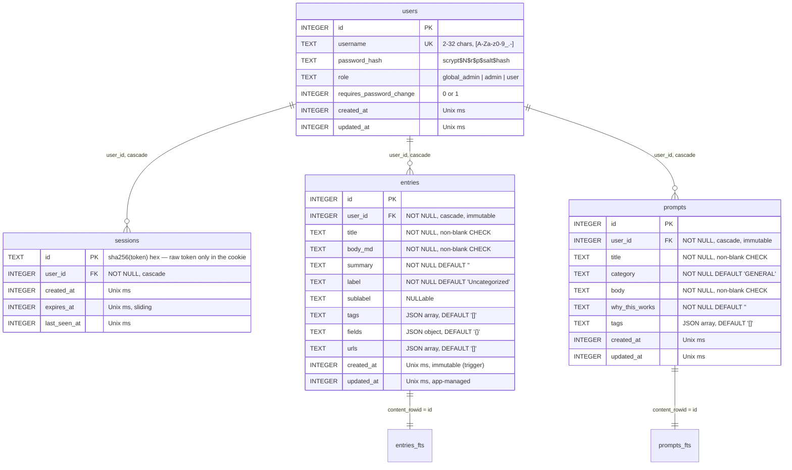

# Bento OS — Database Model (Local / SQLite variant)

> Companion documents: [IMPLEMENTATION-LOCAL.md](IMPLEMENTATION-LOCAL.md) · [DATABASE-SUPABASE.md](DATABASE-SUPABASE.md) · [SECURITY.md](SECURITY.md) · [EDGE-CASES.md](EDGE-CASES.md)
>
> Source of truth: [server/migrations/](../server/migrations/) (schema) and
> [server/db.js](../server/db.js) (bootstrap, WAL config, seeds). This
> document describes the **multi-user, authenticated** SQLite schema as of
> migration `003-auth.sql` (`SCHEMA_VERSION = 3`). The pre-auth single-user
> schema (v2) is described in [IMPLEMENTATION-PLAN.md §2](IMPLEMENTATION-PLAN.md).
>
> This is the **local** variant: authentication, RBAC, and per-user data
> isolation are all enforced by Express against a single SQLite file. The
> Supabase/Postgres equivalent of this same feature set is
> [DATABASE-SUPABASE.md](DATABASE-SUPABASE.md).

---

## 1. Engine & shape

SQLite via `better-sqlite3`, single file at `data/bento.db`, WAL mode. What
changed from the single-user era: two content tables gained a `user_id`
owner column, and three new tables were added for authentication and RBAC.

Five tables + two FTS shadow tables:

- **`entries`** / **`prompts`** — the two content domains, now **per-user**
  (`user_id → users.id`). Ownership is enforced in every query by the Express
  routes (the SQLite analogue of Postgres RLS — there is no row-level engine
  in SQLite, so scoping is a `WHERE user_id = ?` discipline, see §4).
- **`users`** — identity, password hash, role, and the
  `requires_password_change` forced-rotation flag. At most **one**
  `global_admin` (partial unique index).
- **`sessions`** — server-side opaque session store; the browser holds only
  an httpOnly cookie, never a token readable by JS.
- **`rate_limits`** — fixed-window counters for login and admin password
  resets (survives restarts, unlike an in-memory map).
- **`entries_fts`** / **`prompts_fts`** — unchanged FTS5 shadow tables; search
  is scoped per-user in the JOIN query, not in the index.

### PRAGMAs (unchanged, `server/db.js`)

```sql
PRAGMA journal_mode = WAL;
PRAGMA synchronous  = NORMAL;
PRAGMA busy_timeout = 5000;
PRAGMA foreign_keys = ON;   -- now load-bearing: user_id / session FKs cascade
```

`PRAGMA foreign_keys = ON` was future-proofing before; it is now **required**
— the `ON DELETE CASCADE` chain from `users` is what makes GDPR account
deletion a real hard delete (§7).

## 2. Entity-relationship diagram



`rate_limits(key, window_start, count)` and the `schema_migrations` ledger
aren't drawn — they're bookkeeping, not part of the app's data model.

## 3. Tables

### `users`

```sql
CREATE TABLE users (
  id                       INTEGER PRIMARY KEY,
  username                 TEXT    NOT NULL UNIQUE
                             CHECK (length(username) BETWEEN 2 AND 32),
  password_hash            TEXT    NOT NULL,        -- scrypt$N$r$p$salt$hash
  role                     TEXT    NOT NULL DEFAULT 'user'
                             CHECK (role IN ('global_admin','admin','user')),
  requires_password_change INTEGER NOT NULL DEFAULT 0,
  created_at               INTEGER NOT NULL,
  updated_at               INTEGER NOT NULL
);

-- At most ONE global admin, enforced by the DB (mirrors the Postgres
-- `one_global_admin` partial unique index).
CREATE UNIQUE INDEX one_global_admin ON users(role) WHERE role = 'global_admin';
```

- `username` character rules (`^[A-Za-z0-9][A-Za-z0-9_.-]{1,31}$`) are
  enforced in `server/validate.js`; the DB CHECK only guards length (SQLite
  has no native regex). Case-insensitive uniqueness is enforced by storing
  usernames lowercased.
- `password_hash` is never sent to any client — not in `/api/auth/me`, not in
  the admin user list (§ data blindness in IMPLEMENTATION-LOCAL §5).
- `requires_password_change = 1` on the bootstrapped global admin and on any
  account an admin resets; the server blocks all non-auth routes until it's
  cleared (IMPLEMENTATION-LOCAL §4).

### `sessions`

```sql
CREATE TABLE sessions (
  id           TEXT    PRIMARY KEY,   -- sha256(raw token), hex
  user_id      INTEGER NOT NULL REFERENCES users(id) ON DELETE CASCADE,
  created_at   INTEGER NOT NULL,
  expires_at   INTEGER NOT NULL,      -- sliding; refreshed on activity
  last_seen_at INTEGER NOT NULL
);
CREATE INDEX sessions_user_idx    on sessions(user_id);
CREATE INDEX sessions_expires_idx on sessions(expires_at);
```

The raw 256-bit token lives **only** in the httpOnly cookie sent to the
browser; the table stores its SHA-256 so a database leak cannot be replayed
as a live session (same reasoning as hashing passwords). Expired rows are
swept opportunistically on lookup and by a periodic sweep.

### `entries` / `prompts` (owner column added)

Identical to the single-user schema (see [IMPLEMENTATION-PLAN.md §2](IMPLEMENTATION-PLAN.md))
except each gains:

```sql
ALTER TABLE entries ADD COLUMN user_id INTEGER NOT NULL DEFAULT 0
  REFERENCES users(id) ON DELETE CASCADE;
ALTER TABLE prompts ADD COLUMN user_id INTEGER NOT NULL DEFAULT 0
  REFERENCES users(id) ON DELETE CASCADE;
CREATE INDEX entries_user_idx ON entries(user_id, updated_at DESC);
CREATE INDEX prompts_user_idx ON prompts(user_id, category, title);
```

- Migration `003` backfills all pre-existing rows to the bootstrapped global
  admin, then the routes always set `user_id` on insert and filter on it for
  every read/update/delete.
- `user_id` is **immutable** after insert — enforced by the same trigger that
  guards `created_at` (below), extended to ownership.
- `created_at` immutability is preserved from the single-user schema:

```sql
CREATE TRIGGER entries_immutable
BEFORE UPDATE ON entries
WHEN new.created_at != old.created_at OR new.user_id != old.user_id
BEGIN
  SELECT RAISE(ABORT, 'created_at and user_id are immutable');
END;
```

### `rate_limits`

```sql
CREATE TABLE rate_limits (
  key          TEXT    NOT NULL,   -- e.g. 'login:<username>' | 'pw-reset:<admin id>'
  window_start INTEGER NOT NULL,   -- Unix ms, floored to the window
  count        INTEGER NOT NULL DEFAULT 1,
  PRIMARY KEY (key, window_start)
);
```

A fixed-window counter, incremented atomically inside a transaction
(`bumpRateLimit(key, windowMs, max)` in `server/auth.js`). Used to throttle
login attempts (per username) and admin password resets (per admin). It's a
table rather than an in-process map so limits survive a server restart — the
single-process analogue of the Supabase variant's `rate_limits` table +
`bump_rate_limit()` RPC.

## 4. Per-user isolation (RLS, done in the route layer)

SQLite has no row-level security engine, so isolation is a **query
discipline** enforced in `server/routes/*`:

| Operation | Enforcement |
|---|---|
| list / search | `WHERE user_id = ?` appended to every `SELECT` (and to the FTS JOIN) |
| read one | `SELECT … WHERE id = ? AND user_id = ?` → 404 if not owned (never "403", to avoid leaking existence) |
| insert | `user_id` set to `req.user.id` server-side; never taken from the body |
| update / delete | `… WHERE id = ? AND user_id = ?`; zero rows → 404 |

Because scoping lives in code, the invariant is grep-enforceable: every
`db.prepare` touching `entries`/`prompts` must carry a `user_id` predicate.
See IMPLEMENTATION-LOCAL §6 for the shared helper that makes this hard to
forget. Admins get **no** cross-user read path to LogBook/Prompt data — data
blindness is preserved by simply never writing such a query.

## 5. Full-text search (unchanged FTS5, scoped in the query)

The FTS5 virtual tables and their sync triggers are exactly as in the
single-user schema (`entries_fts`, `prompts_fts`, `content='…'`,
`tokenize='porter unicode61'`; see [IMPLEMENTATION-PLAN.md §2](IMPLEMENTATION-PLAN.md)).
The index still covers **all** users' rows; per-user scoping is applied where
the FTS virtual table is JOINed back to the base table:

```sql
SELECT e.* FROM entries_fts f
  JOIN entries e ON e.id = f.rowid
 WHERE entries_fts MATCH ? AND e.user_id = ?
 ORDER BY rank;
```

`ORDER BY rank` (BM25 relevance) is retained — a behavior the Supabase
variant had to trade away (DATABASE-SUPABASE §5), so search relevance is
actually **better** here. `ftsQuery()` still rewrites user input into quoted
prefix tokens so MATCH can't be injected (SECURITY.md §3).

## 6. Migrations

Append-only, numbered, transactional, tracked in `schema_migrations`
(unchanged runner in `server/db.js`).

| # | File | What it does |
|---|---|---|
| 001 | `001-init.sql` | Initial `entries`, `prompts`, both `*_fts` + sync triggers |
| 002 | `002-dynamic-fields.sql` | Adds `entries.fields`; drops `platform`/`is_valid`; rebuilds `entries_fts` |
| 003 | `003-auth.sql` | Adds `users`, `sessions`, `rate_limits`; adds `user_id` to `entries`/`prompts` (+ indexes, immutability trigger); backfills existing rows to the bootstrapped global admin |

Migration `003` runs its data backfill inside the same transaction that adds
the column, so a half-applied auth migration is impossible. The bootstrap of
the global-admin **row** itself happens in `server/db.js`'s seed step (not in
SQL), because it needs to compute a scrypt hash in JS — see IMPLEMENTATION-LOCAL §3.

## 7. Hard deletes (GDPR / PDPA)

Account deletion is `DELETE FROM users WHERE id = ?`. Every dependent FK
(`sessions`, `entries`, `prompts`) is `ON DELETE CASCADE`, so the row and all
of that user's content vanish in one statement — no soft-delete flags, no
retained PII. The global admin cannot self-delete (the singleton superuser
must exist); the route rejects it. Entry/prompt deletion has always been a
hard `DELETE` and is unchanged. Run `VACUUM` (or `PRAGMA auto_vacuum`) if you
need the freed pages returned to the OS promptly.

## 8. Modeling decisions worth knowing

- **Isolation is a code invariant, not an engine guarantee.** Unlike the
  Postgres variant's RLS, nothing in SQLite stops a route that *forgets* its
  `user_id` predicate from leaking across users. The shared query helpers in
  IMPLEMENTATION-LOCAL §6 exist specifically to make that mistake hard; treat
  any raw `entries`/`prompts` query without a `user_id` clause as a bug.
- **Sessions are server-side on purpose.** The httpOnly cookie means a
  successful XSS cannot read the session token (the Supabase variant's
  localStorage JWT can be exfiltrated — see DATABASE-SUPABASE §/review notes).
- **`user_id` uses `INTEGER`, not UUID.** The single-user schema is integer-
  keyed and callers already treat ids opaquely; there's no cross-org exposure
  concern for a self-hosted local app, so integer PKs stay.
- **`entries` and `prompts` remain unrelated** (no cross-links); a join table
  with cascading FKs is still the right shape if that's ever wanted.
