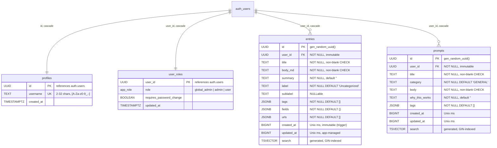

# Bento OS — Database Model (Supabase / PostgreSQL variant)

> Companion documents: [IMPLEMENTATION-SUPABASE.md](IMPLEMENTATION-SUPABASE.md) · [DATABASE-LOCAL.md](DATABASE-LOCAL.md) · [SECURITY.md](SECURITY.md) · [EDGE-CASES.md](EDGE-CASES.md)
>
> Source of truth: `supabase/migrations/` on the `main` / `dev-supabase`
> line. This document describes the schema as of `20260718000002_skills.sql`
> (`SCHEMA_VERSION = 5`, the Supabase/PostgreSQL era). The local SQLite
> equivalent of this same feature set is [DATABASE-LOCAL.md](DATABASE-LOCAL.md).

---

## 1. Engine & shape

PostgreSQL on Supabase, accessed from the browser through PostgREST via the
vendored `supabase-js` SDK — there is no application data server anymore
(Express is reduced to a static host). Nine public tables:

- **`entries`** / **`prompts`** / **`snippets`** — the three content domains,
  per-user (`user_id → auth.users`) with owner-only Row-Level Security.
- **`profiles`** — public identity (username only; deliberately no auth PII).
- **`user_roles`** — RBAC (`global_admin` ×1 / `admin` / `user`) plus the
  `requires_password_change` forced-rotation flag.
- **`rate_limits`** — fixed-window counters for Edge Functions (service-role
  only: RLS enabled with zero policies).
- **`skill_catalog`** / **`user_skills`** / **`skill_cache`** — the Skills
  tab's admin-curated catalog, per-user install tracking, and server-only
  GitHub content cache (§10).

The FTS5 shadow tables and their trigger synchronization are gone, replaced
by a generated `search tsvector` column + GIN index on both content tables —
the index can no longer silently desync from its base table.

## 2. Entity-relationship diagram

`rate_limits(key, window_start, count)` isn't drawn — it's Edge Function
bookkeeping. Supabase's own `schema_migrations` ledger replaces the old
hand-rolled one.

## 3. Column conventions

- **Primary keys**: `uuid DEFAULT gen_random_uuid()` (was SQLite
  `INTEGER PRIMARY KEY`). Clients treat IDs as opaque strings.
- **Timestamps**: `created_at` / `updated_at` stay **UNIX-ms bigints** — the
  client's optimistic-concurrency guard (`UPDATE … WHERE updated_at =
  expected`, zero rows ⇒ 409) compares them numerically, and Modified is
  user-editable (EDGE-CASES §6). `created_at` and `user_id` are immutable via
  the `forbid_immutable_changes()` trigger.
- **`tags` / `fields` / `urls`**: real `jsonb` (were JSON-in-TEXT). Tag
  filtering uses `@>` containment against the GIN `jsonb_path_ops` indexes.
- **CHECK constraints**: non-blank `title`/`body_md` (entries) and
  `title`/`body` (prompts); `src/js/normalize.js` mirrors them client-side
  for friendly error messages.

## 4. Row-Level Security

RLS is enabled on every public table. "owner" = `user_id = auth.uid()`.

| Table | SELECT | INSERT | UPDATE | DELETE |
|---|---|---|---|---|
| entries | owner | owner | owner | owner |
| prompts | owner | owner | owner | owner |
| snippets | owner | owner | owner | owner |
| profiles | self **or** admin | — (signup trigger) | — | — (cascade only) |
| user_roles | self **or** admin | — (signup trigger) | — (RPC / service role) | — (cascade only) |
| rate_limits | — | — | — | — |
| skill_catalog | authenticated | admin | admin | admin |
| user_skills | owner | owner | owner | owner |
| skill_cache | authenticated | — (service role) | — (service role) | — (service role) |

Admins have **no** policy on the content tables (entries/prompts/snippets):
LogBook data blindness is structural and deliberately does **not** extend to
`skill_catalog`, which is shared, admin-curated reference data rather than
user content (§10). `user_roles` has no client write path, so self-elevation
is impossible; role changes go through `SECURITY DEFINER` RPCs or
service-role Edge Functions, and the `one_global_admin` partial unique index
caps the superuser count at one.

## 5. Full-text search

Generated column on both content tables; weights mirror the old FTS5 order:

| Weight | entries | prompts |
|---|---|---|
| A | title | title |
| B | tags, fields | tags, category |
| C | summary | body |
| D | body_md | — |

Queried with `.textSearch('search', q, { type: 'websearch', config:
'english' })`. `websearch` parsing keeps user input literal, so the old
`ftsQuery()` MATCH-escaping hack is gone. **Behavior change vs local:**
results are ordered by `updated_at DESC` rather than BM25 rank (PostgREST
can't order by `ts_rank` without an RPC); the local SQLite variant keeps
`ORDER BY rank` (DATABASE-LOCAL §5).

## 6. Functions & triggers

| Object | Kind | Purpose |
|---|---|---|
| `handle_new_user()` | trigger on `auth.users` | creates `profiles` + `user_roles` rows at signup, then seeds welcome content |
| `seed_user_content(uuid)` | `SECURITY DEFINER` fn | idempotent Welcome entry + example prompt for a new user; execute revoked from all client roles |
| `forbid_immutable_changes()` | trigger on entries/prompts/snippets | `created_at` / `user_id` immutability |
| `role_of(uuid)`, `is_admin()`, `is_global_admin()` | `SECURITY DEFINER` fns | recursion-safe role checks usable inside policies |
| `promote_to_admin(uuid)` / `demote_to_user(uuid)` | RPC | global-admin-only role changes |
| `mark_password_changed()` | RPC | clears the caller's own forced-rotation flag |
| `bump_rate_limit(text, int)` | RPC (service role) | atomic fixed-window counter for Edge Functions |
| `one_global_admin` | partial unique index | at most ONE `global_admin` row can exist |

## 7. Hard deletes & encryption

Every user-data FK cascades from `auth.users`: deleting a user (GDPR/PDPA
erasure via the `delete-account` Edge Function) permanently hard-deletes
profile, role row, entries and prompts — no soft-delete flags. `pgcrypto` is
enabled for `gen_random_uuid()` and optional column-level encryption of
designated highly-sensitive PII; the pattern and key-management caveats are
in IMPLEMENTATION-SUPABASE §7.

## 8. Modeling decisions worth knowing

- **Tags/urls/fields stay denormalized** (now `jsonb`). Postgres can index
  containment queries if a server-side tag filter is ever needed.
- **`entries` and `prompts` remain unrelated.** Cross-linking wants a real
  join table with cascading FKs.
- **Content-table timestamps deliberately stayed numeric** (`bigint`, not
  `timestamptz`): the optimistic-concurrency contract and editable Modified
  field are numeric end-to-end. RBAC tables use `timestamptz`.

## 10. Skills catalog (schema v5)

Added by `20260718000002_skills.sql`. Unlike entries/prompts/snippets this
is **shared, not personal, content**: the catalog is admin-curated and every
authenticated user reads the same rows.

- **`skill_catalog`** — one row per catalog skill (`name` unique;
  `unique(owner, repo, skill_path)`), seeded with the 12 verified skills at
  migration time. `select` is open to any authenticated user; `insert` /
  `update` / `delete` require `is_admin()`.
- **`user_skills`** — per-user "I've installed this" tracking
  (`pk(user_id, skill_id)`), owner-only RLS like entries/prompts/snippets.
  `installed_sha` is a snapshot of the upstream tree SHA at the moment the
  user marked it installed — self-reported, not verified against a real
  filesystem.
- **`skill_cache`** — server-only cache of fetched `SKILL.md` content plus
  the upstream tree SHA and ETag, keyed `pk(skill_id)`. `select` is open to
  authenticated users (so the client can read a previously-fetched body
  without another round trip); there are **no** insert/update/delete
  policies — only the `skills-proxy` Edge Function's service-role client
  (which bypasses RLS) ever writes it.

`update_available` is computed client-side (`src/js/api.js`), not stored:
`user_skills.installed_sha != skill_cache.upstream_sha`. Content actually
comes from GitHub, fetched server-side only (the client CSP forbids
external fetches) with a 1-hour cache TTL and a shared rate budget — see
`supabase/functions/skills-proxy/index.ts` and IMPLEMENTATION-SUPABASE.md.

## 11. Known gaps (from the code review of this variant)

Two schema-level items surfaced in review and are worth carrying forward if
this variant is hardened further (both are **fixed by design** in the local
variant — see IMPLEMENTATION-LOCAL §4):

- **`requires_password_change` is not enforced by RLS.** The policies check
  only `user_id = auth.uid()`; the forced-rotation gate lives only in
  frontend routing, so a valid JWT for a flagged account can read/write data
  by calling the REST API directly. A trigger or a policy predicate against
  `user_roles.requires_password_change` would close it.
- **No server-side password policy.** GoTrue has no configured minimum length
  or default-password ban, so the 8-char / no-`bentoos` rules are
  client-only; set `minimum_password_length` (and validate in
  `mark_password_changed()` or an Edge Function) to enforce them server-side.
