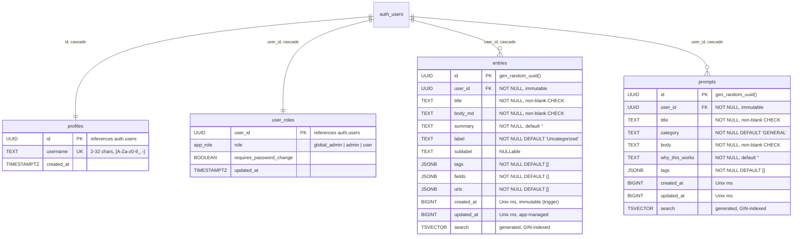

# Bento OS — Database Model

> Companion documents: [SUPABASE-MIGRATION.md](SUPABASE-MIGRATION.md) · [SECURITY.md](SECURITY.md) · [EDGE-CASES.md](EDGE-CASES.md)
>
> Source of truth: [supabase/migrations/](../supabase/migrations/). This
> document describes the schema as of `20260714000001_init.sql`
> (`SCHEMA_VERSION = 3`, the Supabase/PostgreSQL era) — regenerate it after
> adding a migration rather than hand-patching drift. The old SQLite model
> (schema v2) is preserved in git history under `server/migrations/`.

---

## 1. Engine & shape

PostgreSQL on Supabase, accessed from the browser through PostgREST via the
vendored `supabase-js` SDK — there is no application data server anymore.
Five public tables:

- **`entries`** / **`prompts`** — the two content domains, now per-user
  (`user_id → auth.users`) with owner-only Row-Level Security.
- **`profiles`** — public identity (username only; deliberately no auth PII).
- **`user_roles`** — RBAC (`global_admin` ×1 / `admin` / `user`) plus the
  `requires_password_change` forced-rotation flag.
- **`rate_limits`** — fixed-window counters for Edge Functions (service-role
  only: RLS enabled with zero policies).

The FTS5 shadow tables and their trigger synchronization are gone, replaced
by a generated `search tsvector` column + GIN index on both content tables —
the index can no longer silently desync from its base table.

## 2. Entity-relationship diagram

`rate_limits(key, window_start, count)` isn't drawn — it's Edge Function
bookkeeping, not part of the app's data model. Supabase's own
`schema_migrations` ledger replaces the old hand-rolled one.

## 3. Column conventions

- **Primary keys**: `uuid DEFAULT gen_random_uuid()` (was SQLite
  `INTEGER PRIMARY KEY` autoincrement). Clients treat IDs as opaque strings.
- **Timestamps**: `created_at` / `updated_at` stay **UNIX-ms bigints** — the
  client's optimistic-concurrency guard (`UPDATE … WHERE updated_at =
  expected`, zero rows ⇒ 409) compares them numerically, and Modified is
  user-editable (EDGE-CASES §6). `created_at` and `user_id` are immutable via
  the `forbid_immutable_changes()` trigger — same defense-in-depth idea as
  the old SQLite `entries_created_at_immutable` trigger, extended to
  ownership.
- **`tags` / `fields` / `urls`**: real `jsonb` (were JSON-in-TEXT). Tag
  filtering uses `@>` containment against the GIN `jsonb_path_ops` indexes.
- **CHECK constraints**: non-blank `title`/`body_md` (entries) and
  `title`/`body` (prompts) carry over unchanged; `src/js/normalize.js`
  mirrors them client-side for friendly error messages.

## 4. Row-Level Security

RLS is enabled on every public table. "owner" = `user_id = auth.uid()`.

| Table | SELECT | INSERT | UPDATE | DELETE |
|---|---|---|---|---|
| entries | owner | owner | owner | owner |
| prompts | owner | owner | owner | owner |
| profiles | self **or** admin | — (signup trigger) | — | — (cascade only) |
| user_roles | self **or** admin | — (signup trigger) | — (RPC / service role) | — (cascade only) |
| rate_limits | — | — | — | — |

Admins have **no** policy on the content tables: LogBook data blindness is
structural. `user_roles` has no client write path at all, so self-elevation
is impossible; role changes go through `SECURITY DEFINER` RPCs or
service-role Edge Functions, and the `one_global_admin` partial unique index
caps the superuser count at one.

## 5. Full-text search

Generated column on both content tables; weights mirror the old FTS5 column
order:

| Weight | entries | prompts |
|---|---|---|
| A | title | title |
| B | tags, fields | tags, category |
| C | summary | body |
| D | body_md | — |

Queried with `.textSearch('search', q, { type: 'websearch', config:
'english' })`. `websearch` parsing keeps user input literal, so the old
`ftsQuery()` MATCH-escaping hack is gone. One behavior change: results are
ordered by `updated_at DESC` rather than BM25 rank (PostgREST can't order by
`ts_rank` without an RPC — add one if relevance ordering ever matters).

## 6. Functions & triggers

| Object | Kind | Purpose |
|---|---|---|
| `handle_new_user()` | trigger on `auth.users` | creates `profiles` + `user_roles` rows at signup |
| `forbid_immutable_changes()` | trigger on entries/prompts | `created_at` / `user_id` immutability |
| `role_of(uuid)`, `is_admin()`, `is_global_admin()` | `SECURITY DEFINER` fns | recursion-safe role checks usable inside policies |
| `promote_to_admin(uuid)` / `demote_to_user(uuid)` | RPC | global-admin-only role changes |
| `mark_password_changed()` | RPC | clears the caller's own forced-rotation flag |
| `bump_rate_limit(text, int)` | RPC (service role) | atomic fixed-window counter for Edge Functions |
| `one_global_admin` | partial unique index | at most ONE `global_admin` row can exist |

## 7. Hard deletes & encryption

Every user-data FK cascades from `auth.users`: deleting a user (GDPR/PDPA
erasure via the `delete-account` Edge Function) permanently hard-deletes
profile, role row, entries and prompts — there are no soft-delete flags
anywhere in the schema. `pgcrypto` is enabled for `gen_random_uuid()` and
for optional column-level encryption of designated highly-sensitive PII;
the pattern (and its key-management caveats) is documented in
SUPABASE-MIGRATION.md §7.

## 8. Modeling decisions worth knowing before you touch this

- **Tags/urls/fields stay denormalized** (now `jsonb` instead of TEXT-JSON).
  Same trade as before — client-side pill filtering over the loaded set,
  FTS covering the text — but Postgres can now index containment queries if
  a server-side tag filter is ever needed.
- **`entries` and `prompts` remain unrelated.** Cross-linking still wants a
  real join table with cascading FKs, not a bolt-on to either JSON column.
- **Timestamps deliberately did not move to `timestamptz`** for content
  tables: the optimistic-concurrency contract and the editable Modified
  field are numeric end-to-end. RBAC tables, which no client compares, use
  `timestamptz`.
